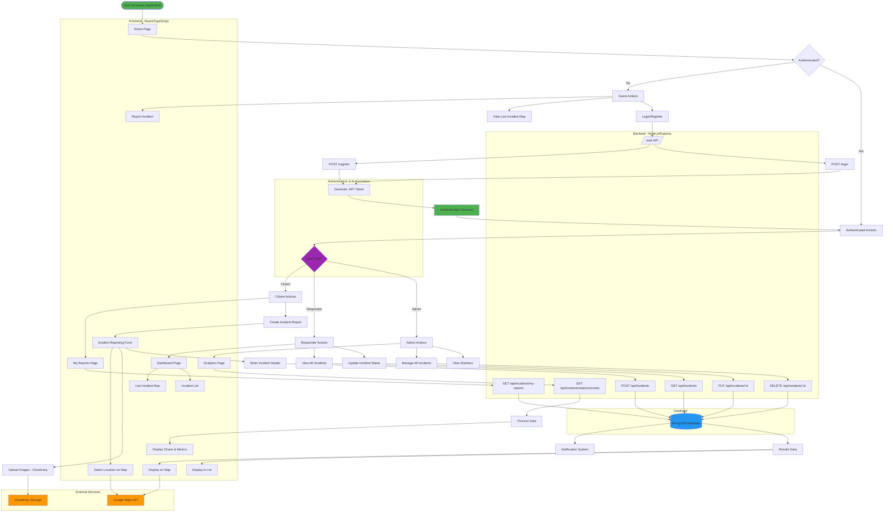
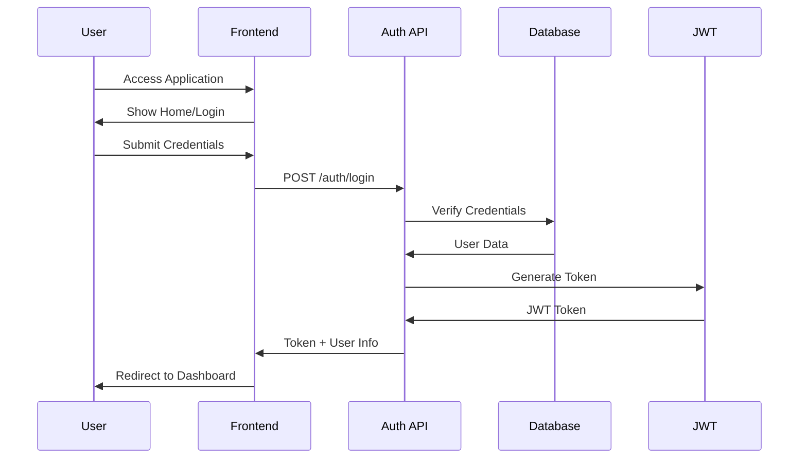
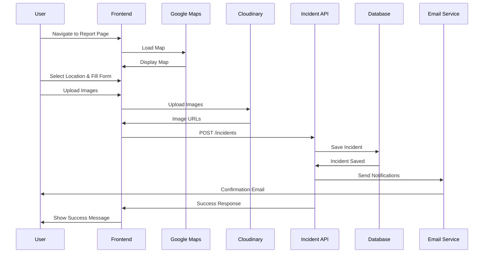
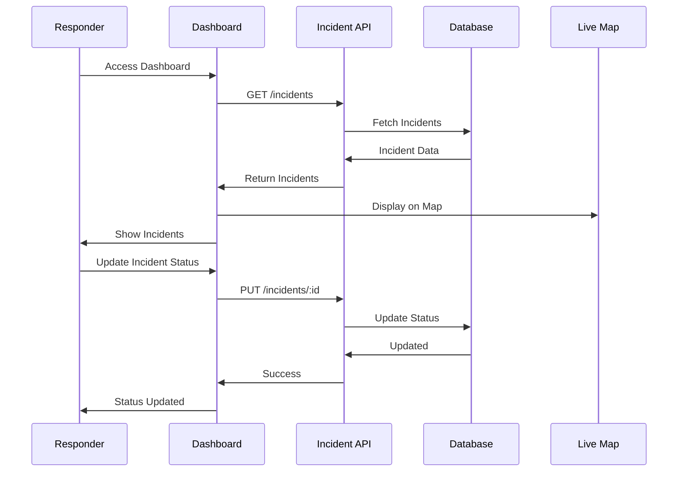
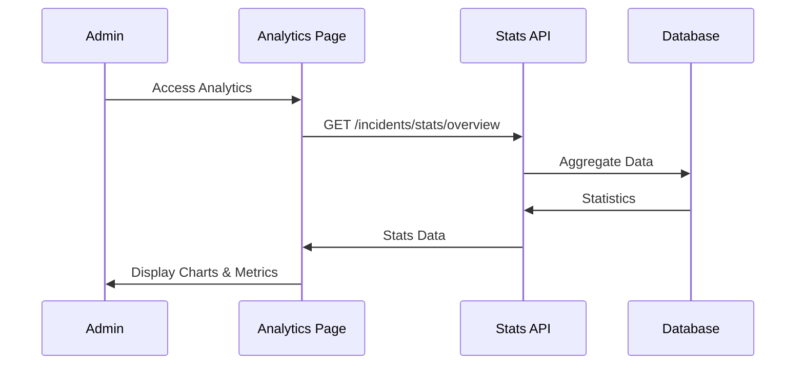

# IVARS - Incident Verification and Reporting System
## Workflow Block Diagram

> **Note**: All workflow diagrams are available as PNG images in the `/diagrams` folder.

## Main Workflow Diagram


<details>
<summary>View Mermaid Code</summary>



</details>

## Detailed Workflow Components

### 1. **User Authentication Flow**


<details>
<summary>View Mermaid Code</summary>



</details>

### 2. **Incident Reporting Flow**


<details>
<summary>View Mermaid Code</summary>



</details>

### 3. **Incident Management Flow (Responder/Admin)**


<details>
<summary>View Mermaid Code</summary>



</details>

### 4. **Analytics Flow (Admin Only)**


<details>
<summary>View Mermaid Code</summary>



</details>

## System Architecture

### **Frontend (React + TypeScript)**
- **Pages**: Home, Report, Dashboard, Analytics, My Reports
- **Components**: Map, Header, Login Modal, Protected Routes
- **Services**: Auth, Incident, User APIs
- **Routing**: React Router with role-based access

### **Backend (Node.js + Express)**
- **Controllers**: Auth, Incident, User, Distance, Places
- **Models**: User, Incident (MongoDB/Mongoose)
- **Middleware**: Authentication, Authorization, File Upload
- **Services**: Email notifications
- **Routes**: RESTful API endpoints

### **External Integrations**
- **Google Maps API**: Location selection and visualization
- **Cloudinary**: Image storage and management
- **MongoDB**: Database for users and incidents

## User Roles & Permissions

| Role | Permissions |
|------|-------------|
| **Guest** | View map, Report incidents (optional auth) |
| **Citizen** | All guest + View my reports, Full reporting |
| **Responder** | All citizen + View dashboard, Update incident status |
| **Admin** | All responder + Analytics, Delete incidents, Manage users |

## API Endpoints Summary

### Authentication
- `POST /api/auth/register` - Register new user
- `POST /api/auth/login` - Login user
- `GET /api/auth/me` - Get current user

### Incidents
- `POST /api/incidents` - Create incident (optional auth)
- `GET /api/incidents` - Get all incidents
- `GET /api/incidents/my-reports` - Get user's incidents (protected)
- `GET /api/incidents/:id` - Get specific incident
- `PUT /api/incidents/:id` - Update incident (responder/admin)
- `DELETE /api/incidents/:id` - Delete incident (admin only)
- `GET /api/incidents/stats/overview` - Get statistics (protected)

### Additional Services
- Distance calculation API
- Places/nearby resources API
- User management API

## Data Flow

```
User Input → Frontend Validation → API Request → 
Backend Validation → Database Operation → Response → 
Frontend Update → User Notification
```

## Key Features
1. ✅ Real-time incident mapping
2. ✅ Role-based access control
3. ✅ Image upload with Cloudinary
4. ✅ Google Maps integration
5. ✅ Email notifications
6. ✅ Analytics dashboard
7. ✅ Mobile responsive design
8. ✅ API rate limiting
9. ✅ JWT authentication
