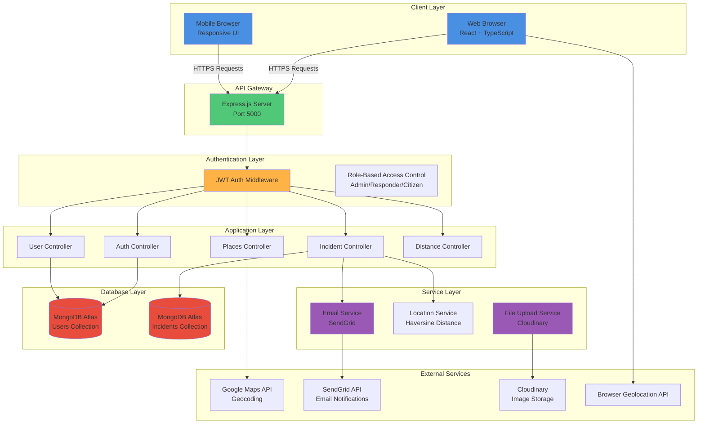

# System Architecture Diagram

## IVARS - Intelligent Vehicle Accident Response System

## Architecture Description

### Client Layer
- **React + TypeScript Frontend**: Single Page Application with responsive design
- **Mobile Browser Support**: Fully responsive UI for mobile access
- **Real-time Updates**: Live incident tracking and status updates

### API Gateway
- **Express.js Server**: RESTful API endpoints
- **CORS Configuration**: Cross-origin resource sharing enabled
- **Compression**: Response compression for faster data transfer

### Authentication Layer
- **JWT-based Authentication**: Secure token-based auth
- **Role-Based Access Control**: 3 user roles (Citizen, Responder, Admin)
- **Protected Routes**: Middleware for route protection

### Application Layer
- **Auth Controller**: User registration, login, authentication
- **Incident Controller**: CRUD operations, nearby responder detection
- **User Controller**: Profile management, location updates
- **Places Controller**: Google Maps integration
- **Distance Controller**: Distance calculations

### Service Layer
- **Email Service**: SendGrid integration for emergency notifications
- **Location Service**: Haversine formula for distance calculations (50km radius)
- **File Upload Service**: Cloudinary integration for incident evidence

### Database Layer
- **MongoDB Atlas**: Cloud-hosted NoSQL database
- **Users Collection**: User profiles, roles, coordinates
- **Incidents Collection**: Accident reports, status tracking

### External Services
- **Google Maps API**: Geocoding and location services
- **SendGrid**: Transactional email delivery
- **Cloudinary**: CDN-based image storage
- **Geolocation API**: Browser-based GPS coordinates
