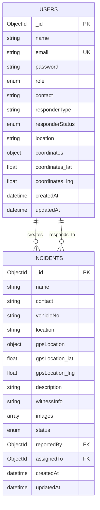
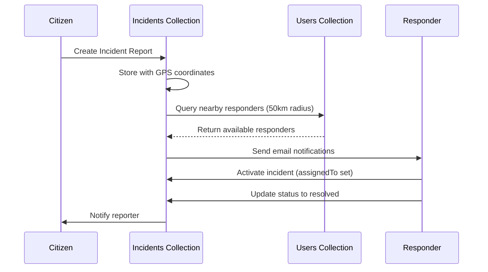

# Database Schema Diagram

## MongoDB Collections and Relationships



## Collection Details

### Users Collection

| Field | Type | Description | Constraints |
|-------|------|-------------|-------------|
| _id | ObjectId | Primary Key | Auto-generated |
| name | String | Full name | Required |
| email | String | Email address | Required, Unique |
| password | String | Hashed password | Required, Min 8 chars |
| role | Enum | User role | citizen/responder/admin |
| contact | String | Phone number | Optional, 10 digits |
| responderType | String | Type of responder | police/ambulance/fire |
| responderStatus | Enum | Availability status | available/busy/offline |
| location | String | Location string | lat,lng format |
| coordinates | Object | GPS coordinates | {lat: Float, lng: Float} |
| coordinates.lat | Float | Latitude | -90 to 90 |
| coordinates.lng | Float | Longitude | -180 to 180 |
| createdAt | DateTime | Creation timestamp | Auto-generated |
| updatedAt | DateTime | Last update timestamp | Auto-generated |

**Indexes:**
- `email`: Unique index
- `coordinates`: 2dsphere geospatial index for location queries

### Incidents Collection

| Field | Type | Description | Constraints |
|-------|------|-------------|-------------|
| _id | ObjectId | Primary Key | Auto-generated |
| name | String | Reporter name | Required |
| contact | String | Contact number | Required, 10 digits |
| vehicleNo | String | Vehicle license plate | Optional |
| location | String | Accident location | Required |
| gpsLocation | Object | GPS coordinates | Required |
| gpsLocation.lat | Float | Latitude | Required |
| gpsLocation.lng | Float | Longitude | Required |
| description | String | Incident description | Required |
| witnessInfo | String | Witness information | Optional |
| images | Array[String] | Cloudinary URLs | Optional |
| status | Enum | Incident status | pending/active/resolved/closed |
| reportedBy | ObjectId | User who reported | Reference to Users |
| assignedTo | ObjectId | Assigned responder | Reference to Users |
| createdAt | DateTime | Report timestamp | Auto-generated |
| updatedAt | DateTime | Last update timestamp | Auto-generated |

**Indexes:**
- `status`: Index for filtering
- `gpsLocation`: 2dsphere geospatial index
- `reportedBy`: Index for user queries
- `assignedTo`: Index for responder queries

## Relationships

1. **Users → Incidents (Reporter)**
   - One user can create multiple incident reports
   - Each incident has one reporter (reportedBy)

2. **Users → Incidents (Responder)**
   - One responder can be assigned to multiple incidents
   - Each incident can be assigned to one responder (assignedTo)

## Data Flow



## Geospatial Queries

The system uses MongoDB's geospatial capabilities:

```javascript
// Find responders within 50km radius
db.users.find({
  role: 'responder',
  responderStatus: 'available',
  coordinates: {
    $near: {
      $geometry: {
        type: "Point",
        coordinates: [longitude, latitude]
      },
      $maxDistance: 50000 // 50km in meters
    }
  }
})
```
