# Use Case Diagram

## IVARS System Use Cases

```mermaid
graph TB
    subgraph "Actors"
        C[Citizen]
        R[Emergency Responder]
        A[Administrator]
        S[System]
    end

    subgraph "Authentication Use Cases"
        UC1[Register Account]
        UC2[Login]
        UC3[Logout]
        UC4[Update Profile]
    end

    subgraph "Citizen Use Cases"
        UC5[Report Accident]
        UC6[Upload Evidence Photos]
        UC7[Get GPS Location]
        UC8[Track Incident Status]
        UC9[View My Reports]
        UC10[Provide Witness Info]
    end

    subgraph "Responder Use Cases"
        UC11[View Dashboard]
        UC12[Receive Email Alerts]
        UC13[Activate Incident]
        UC14[Update Incident Status]
        UC15[Resolve Incident]
        UC16[Update Location]
        UC17[Set Availability Status]
    end

    subgraph "Admin Use Cases"
        UC18[View All Incidents]
        UC19[View Analytics]
        UC20[Manage Users]
        UC21[Delete Incidents]
        UC22[System Monitoring]
    end

    subgraph "System Use Cases"
        UC23[Calculate Distance]
        UC24[Find Nearby Responders]
        UC25[Send Email Notifications]
        UC26[Store Images in Cloud]
        UC27[Geocode Locations]
    end

    C --> UC1
    C --> UC2
    C --> UC5
    C --> UC6
    C --> UC7
    C --> UC8
    C --> UC9
    C --> UC10
    
    R --> UC1
    R --> UC2
    R --> UC11
    R --> UC12
    R --> UC13
    R --> UC14
    R --> UC15
    R --> UC16
    R --> UC17
    
    A --> UC2
    A --> UC18
    A --> UC19
    A --> UC20
    A --> UC21
    A --> UC22
    
    UC5 --> UC23
    UC5 --> UC24
    UC5 --> UC25
    UC6 --> UC26
    UC7 --> UC27
    UC13 --> UC25
    UC15 --> UC25
    
    style C fill:#4A90E2
    style R fill:#50C878
    style A fill:#E74C3C
    style S fill:#9B59B6
```

## Detailed Use Case Descriptions

### 1. Citizen Use Cases

#### UC5: Report Accident
- **Actor:** Citizen
- **Description:** Report a vehicle accident with location and details
- **Preconditions:** User must be logged in
- **Main Flow:**
  1. Citizen navigates to Report page
  2. System captures GPS location
  3. Citizen fills in accident details
  4. Citizen uploads evidence photos (optional)
  5. System validates form data
  6. System creates incident record
  7. System finds nearby responders
  8. System sends email notifications
- **Postconditions:** Incident created, responders notified

#### UC8: Track Incident Status
- **Actor:** Citizen
- **Description:** View status of reported incidents
- **Main Flow:**
  1. Citizen navigates to My Reports
  2. System displays all user's reports
  3. Citizen views status updates
  4. System shows assigned responder details

### 2. Responder Use Cases

#### UC13: Activate Incident
- **Actor:** Emergency Responder
- **Description:** Accept and activate an incident response
- **Preconditions:** Responder is logged in and available
- **Main Flow:**
  1. Responder views incident on dashboard
  2. Responder clicks Activate button
  3. System assigns responder to incident
  4. System updates status to "active"
  5. System sends confirmation email
- **Postconditions:** Incident assigned, responder is now responsible

#### UC15: Resolve Incident
- **Actor:** Emergency Responder (assigned)
- **Description:** Mark incident as resolved after handling
- **Preconditions:** Responder must be assigned to incident
- **Main Flow:**
  1. Responder arrives at scene
  2. Responder handles emergency
  3. Responder clicks Resolve button
  4. System updates status to "resolved"
  5. System notifies reporter
- **Postconditions:** Incident closed, notifications sent

### 3. Admin Use Cases

#### UC19: View Analytics
- **Actor:** Administrator
- **Description:** View system analytics and statistics
- **Main Flow:**
  1. Admin navigates to Analytics page
  2. System displays incident statistics
  3. System shows response time metrics
  4. System displays responder performance
  5. Admin generates reports

### 4. System Use Cases

#### UC24: Find Nearby Responders
- **Actor:** System
- **Description:** Locate available responders within 50km radius
- **Trigger:** Incident reported
- **Main Flow:**
  1. System receives incident GPS coordinates
  2. System queries Users collection
  3. System filters by role="responder" and status="available"
  4. System calculates distances using Haversine formula
  5. System sorts by distance (nearest first)
  6. System returns list of nearby responders
- **Algorithm:** Geospatial query with 50km radius

#### UC25: Send Email Notifications
- **Actor:** System
- **Description:** Send email alerts to responders
- **Trigger:** Incident reported or status changed
- **Main Flow:**
  1. System compiles recipient list
  2. System generates email template
  3. System includes incident details and evidence
  4. System calls SendGrid API
  5. System logs email status
- **Service:** SendGrid API integration

## Use Case Priority Matrix

| Priority | Use Cases |
|----------|-----------|
| **Critical** | UC2 (Login), UC5 (Report Accident), UC13 (Activate), UC15 (Resolve) |
| **High** | UC1 (Register), UC8 (Track Status), UC11 (Dashboard), UC24 (Find Responders) |
| **Medium** | UC6 (Upload Photos), UC16 (Update Location), UC17 (Set Status) |
| **Low** | UC19 (Analytics), UC20 (Manage Users) |
