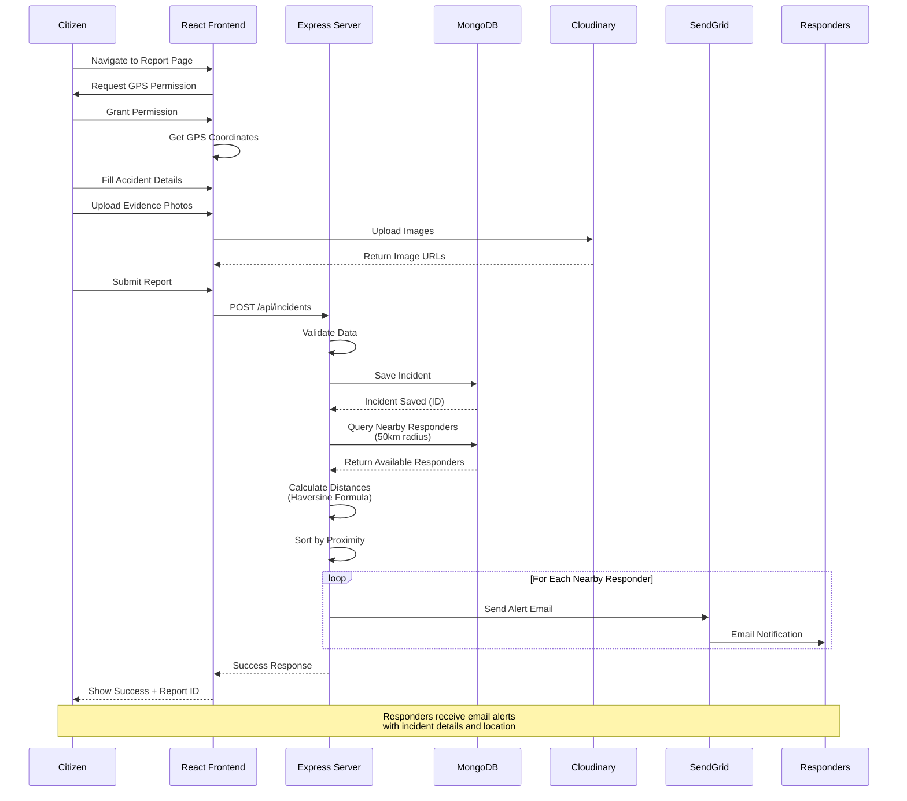
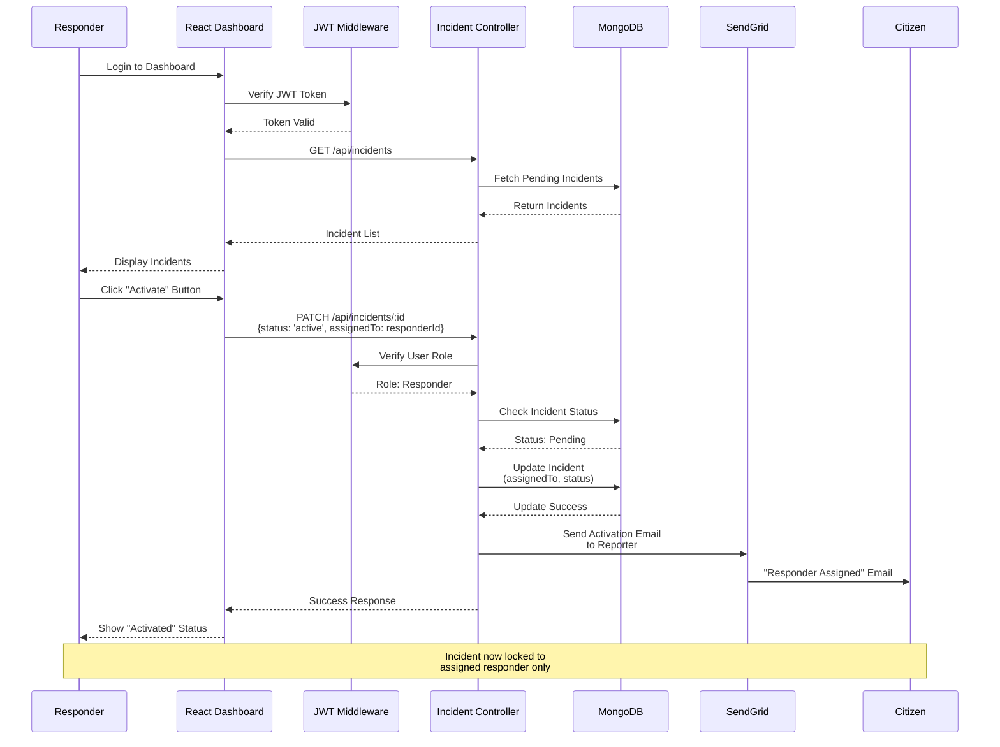
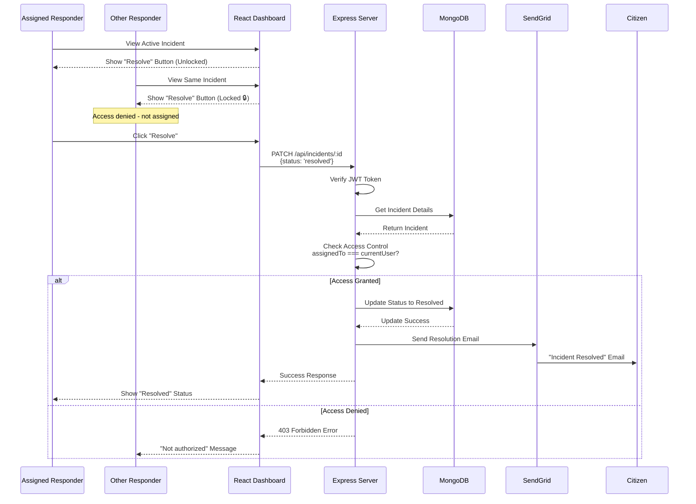
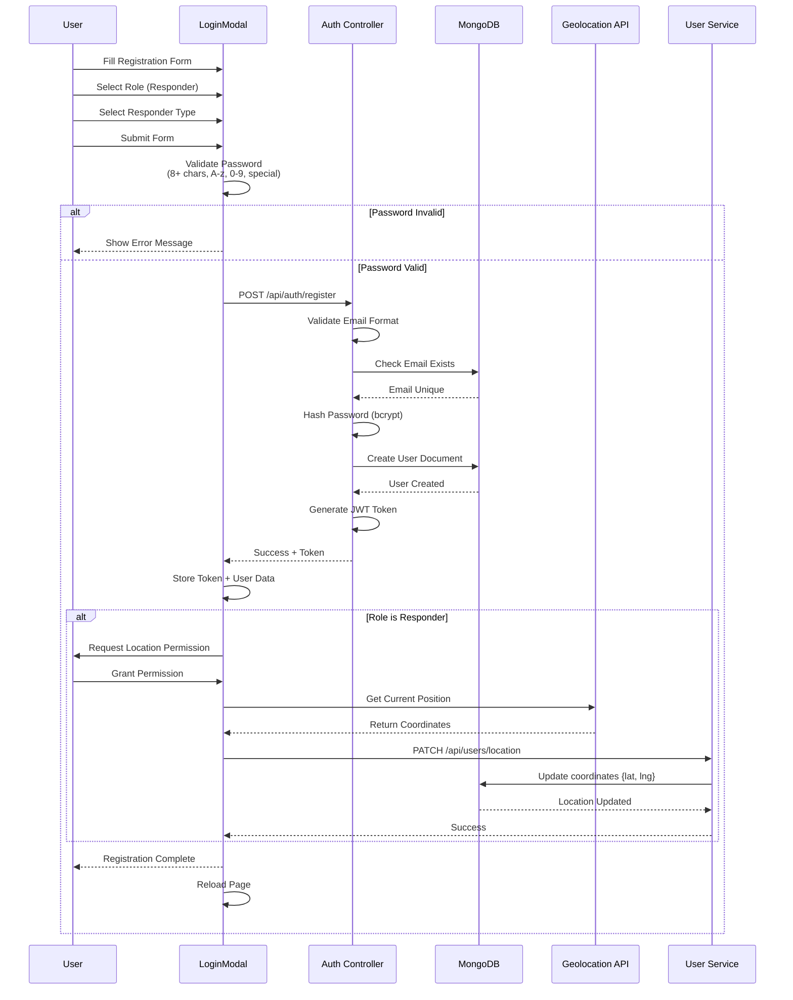
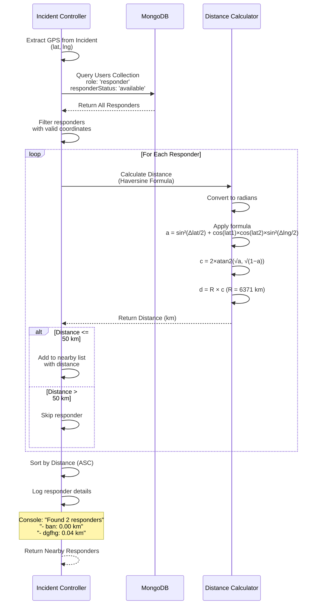

# Sequence Diagrams

## 1. Incident Reporting Flow

## 2. Responder Activation Flow

## 3. Resolution Flow with Access Control

## 4. User Registration & Location Setup

## 5. Nearby Responder Detection Algorithm

## Flow Descriptions

### Key Sequences:

1. **Incident Reporting**: GPS capture → Form validation → Image upload → Database save → Responder search → Email notifications

2. **Responder Activation**: Authentication → Status check → Assignment → Database update → Email confirmation → Access control lock

3. **Resolution**: Access control verification → Status update → Email notification → Dashboard refresh

4. **Registration**: Form validation → Password strength check → Database creation → JWT generation → Location capture (responders only)

5. **Nearby Detection**: GPS extraction → Database query → Distance calculation → Filtering → Sorting → Notification
