# Sequence Diagrams

## 1. Incident Reporting Flow

## 2. Responder Activation Flow

## 3. Resolution Flow with Access Control

```mermaid
sequenceDiagram
    participant R1 as Assigned Responder
    participant R2 as Other Responder
    participant UI as React Dashboard
    participant API as Express Server
    participant DB as MongoDB
    participant Email as SendGrid
    participant C as Citizen

    R1->>UI: View Active Incident
    UI-->>R1: Show "Resolve" Button (Unlocked)
    
    R2->>UI: View Same Incident
    UI-->>R2: Show "Resolve" Button (Locked 🔒)
    
    Note over R2: Access denied - not assigned
    
    R1->>UI: Click "Resolve"
    UI->>API: PATCH /api/incidents/:id<br/>{status: 'resolved'}
    
    API->>API: Verify JWT Token
    API->>DB: Get Incident Details
    DB-->>API: Return Incident
    
    API->>API: Check Access Control<br/>assignedTo === currentUser?
    
    alt Access Granted
        API->>DB: Update Status to Resolved
        DB-->>API: Update Success
        
        API->>Email: Send Resolution Email
        Email->>C: "Incident Resolved" Email
        
        API-->>UI: Success Response
        UI-->>R1: Show "Resolved" Status
    else Access Denied
        API-->>UI: 403 Forbidden Error
        UI-->>R2: "Not authorized" Message
    end
```

## 4. User Registration & Location Setup

## 5. Nearby Responder Detection Algorithm

```mermaid
sequenceDiagram
    participant API as Incident Controller
    participant DB as MongoDB
    participant Calc as Distance Calculator

    API->>API: Extract GPS from Incident<br/>(lat, lng)
    
    API->>DB: Query Users Collection<br/>role: 'responder'<br/>responderStatus: 'available'
    DB-->>API: Return All Responders
    
    API->>API: Filter responders<br/>with valid coordinates
    
    loop For Each Responder
        API->>Calc: Calculate Distance<br/>(Haversine Formula)
        Calc->>Calc: Convert to radians
        Calc->>Calc: Apply formula<br/>a = sin²(Δlat/2) + cos(lat1)×cos(lat2)×sin²(Δlng/2)
        Calc->>Calc: c = 2×atan2(√a, √(1−a))
        Calc->>Calc: d = R × c (R = 6371 km)
        Calc-->>API: Return Distance (km)
        
        alt Distance <= 50 km
            API->>API: Add to nearby list<br/>with distance
        else Distance > 50 km
            API->>API: Skip responder
        end
    end
    
    API->>API: Sort by Distance (ASC)
    API->>API: Log responder details
    
    Note over API: Console: "Found 2 responders"<br/>"- ban: 0.00 km"<br/>"- dgfhg: 0.04 km"
    
    API-->>API: Return Nearby Responders
```

## Flow Descriptions

### Key Sequences:

1. **Incident Reporting**: GPS capture → Form validation → Image upload → Database save → Responder search → Email notifications

2. **Responder Activation**: Authentication → Status check → Assignment → Database update → Email confirmation → Access control lock

3. **Resolution**: Access control verification → Status update → Email notification → Dashboard refresh

4. **Registration**: Form validation → Password strength check → Database creation → JWT generation → Location capture (responders only)

5. **Nearby Detection**: GPS extraction → Database query → Distance calculation → Filtering → Sorting → Notification
