# Flowcharts

## 1. Incident Reporting Process

## 2. Responder Notification & Activation

## 3. Resolution Process with Access Control

```mermaid
flowchart TD
    Start([Responder Views Active Incident]) --> A[Fetch Current User Data]
    A --> B[Get Incident Details]
    
    B --> C{User is Assigned<br/>Responder?}
    C -->|No| D[Show Lock Icon 🔒]
    D --> E[Disable Resolve Button]
    E --> F[Display: Not Authorized]
    F --> End1([End])
    
    C -->|Yes| G[Show Unlock Icon]
    G --> H[Enable Resolve Button]
    H --> I{Click Resolve?}
    
    I -->|No| End2([Continue Monitoring])
    I -->|Yes| J[Show Confirmation Dialog]
    
    J --> K{Confirm Resolution?}
    K -->|No| End2
    K -->|Yes| L[Send PATCH Request<br/>status: 'resolved']
    
    L --> M[Backend Validation]
    M --> N{JWT Valid?}
    N -->|No| O[Return 401]
    O --> P[Redirect to Login]
    P --> End3([Login Required])
    
    N -->|Yes| Q[Fetch Incident from DB]
    Q --> R{assignedTo === currentUser?}
    
    R -->|No| S[Return 403 Forbidden]
    S --> T[Show Error:<br/>Only assigned responder can resolve]
    T --> End4([Access Denied])
    
    R -->|Yes| U{Current Status<br/>is 'active'?}
    U -->|No| V[Return 400 Error:<br/>Invalid status transition]
    V --> End5([Error])
    
    U -->|Yes| W[Update Status to 'resolved']
    W --> X[Update Timestamp]
    X --> Y[Save to Database]
    
    Y --> Z{Save Success?}
    Z -->|No| AA[Return 500 Error]
    AA --> AB[Show Error Message]
    AB --> End6([Database Error])
    
    Z -->|Yes| AC[Send Email to Reporter]
    AC --> AD{Email Sent?}
    AD -->|No| AE[Log Email Error]
    AD -->|Yes| AF[Log Email Success]
    
    AE --> AG[Return Success Response<br/>with Warning]
    AF --> AH[Return Success Response]
    AG --> AI[Update Dashboard UI]
    AH --> AI
    
    AI --> AJ[Change Status to Resolved]
    AJ --> AK[Show Success Message]
    AK --> AL[Disable Resolve Button]
    AL --> End7([Incident Resolved])
    
    style Start fill:#4A90E2
    style End1 fill:#E74C3C
    style End2 fill:#FFB347
    style End3 fill:#E74C3C
    style End4 fill:#E74C3C
    style End5 fill:#E74C3C
    style End6 fill:#E74C3C
    style End7 fill:#50C878
```

## 4. User Authentication Flow

## 5. Password Validation Logic

```mermaid
flowchart TD
    Start([User Types Password]) --> A[Get Password Value]
    A --> B{Length >= 8?}
    
    B -->|No| C[Error: Min 8 characters]
    C --> End1([Show Error])
    
    B -->|Yes| D{Contains Uppercase<br/>A-Z?}
    D -->|No| E[Error: Need uppercase letter]
    E --> End1
    
    D -->|Yes| F{Contains Lowercase<br/>a-z?}
    F -->|No| G[Error: Need lowercase letter]
    G --> End1
    
    F -->|Yes| H{Contains Number<br/>0-9?}
    H -->|No| I[Error: Need number]
    I --> End1
    
    H -->|Yes| J{Contains Special<br/>Character?}
    J -->|No| K[Error: Need special char<br/>!@#$%^&*]
    K --> End1
    
    J -->|Yes| L[All Validations Passed]
    L --> M[Show Green Checkmark ✅]
    M --> N[Enable Submit Button]
    N --> End2([Valid Password])
    
    style Start fill:#4A90E2
    style End1 fill:#E74C3C
    style End2 fill:#50C878
```

## Process Summaries

### Critical Paths:
1. **Report → Notify**: GPS → Form → Upload → Save → Find → Email (< 5 seconds)
2. **Activate**: Click → Verify → Assign → Email (< 2 seconds)
3. **Resolve**: Click → Validate → Update → Notify (< 2 seconds)

### Error Handling:
- Network failures: Retry with exponential backoff
- Validation errors: Display inline with specific messages
- Auth errors: Redirect to login with return URL
- Database errors: Log and show user-friendly message
