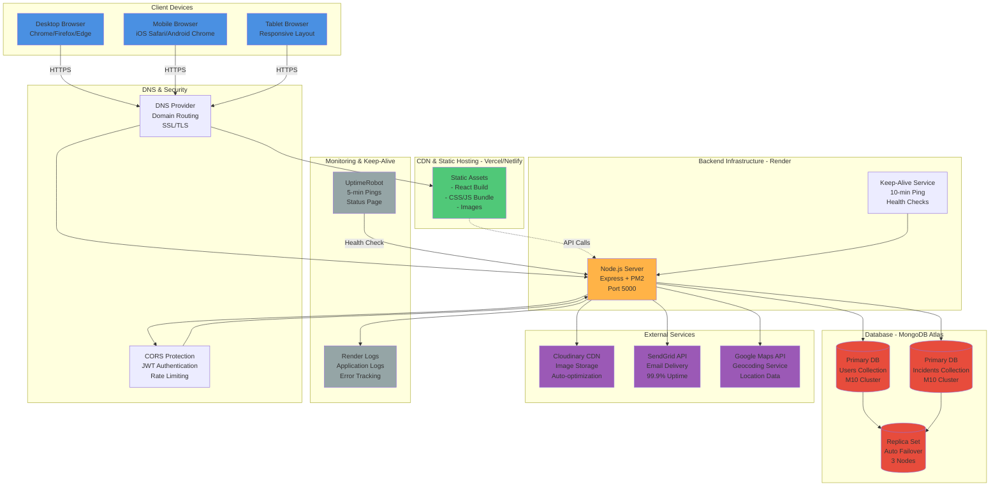
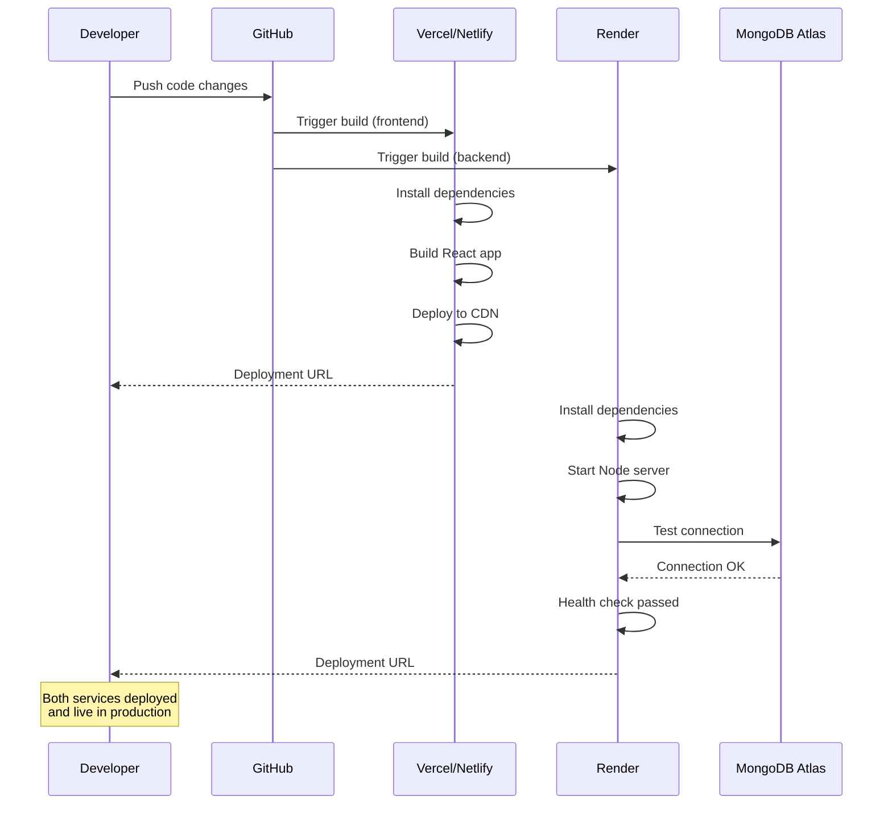

# Deployment Diagram

## IVARS Production Infrastructure



## Deployment Architecture Details

### Frontend Deployment (Vercel/Netlify)

**Platform:** Vercel or Netlify  
**Type:** Static Site Hosting  
**Build Command:** `npm run build`  
**Output Directory:** `dist/`

**Features:**
- ✅ Global CDN (Edge Network)
- ✅ Automatic HTTPS/SSL
- ✅ Instant deployments from Git
- ✅ Preview deployments for PRs
- ✅ Auto-scaling
- ✅ 99.99% uptime SLA

**Environment Variables:**
```env
VITE_API_URL=https://your-backend.onrender.com
VITE_GOOGLE_MAPS_API_KEY=your_key_here
```

**Build Process:**
```bash
# Install dependencies
npm install

# Build optimized production bundle
npm run build

# Output: dist/ folder with:
# - index.html
# - assets/index-[hash].js
# - assets/index-[hash].css
```

### Backend Deployment (Render)

**Platform:** Render  
**Type:** Web Service  
**Runtime:** Node.js 18.x  
**Instance:** Standard Plan  
**Region:** US West (Oregon)

**Configuration:**
```yaml
services:
  - type: web
    name: ivars-backend
    env: node
    buildCommand: npm install
    startCommand: node server.js
    healthCheckPath: /api/health
    autoDeploy: true
```

**Features:**
- ✅ Auto-deploy from Git
- ✅ Free SSL certificates
- ✅ Health checks every 30s
- ✅ Zero-downtime deploys
- ✅ Auto-restart on crashes
- ✅ Environment variable management

**Environment Variables:**
```env
NODE_ENV=production
PORT=5000
MONGO_URI=mongodb+srv://...
JWT_SECRET=your_secret_here
CLOUDINARY_CLOUD_NAME=your_cloud
CLOUDINARY_API_KEY=your_key
CLOUDINARY_API_SECRET=your_secret
SENDGRID_API_KEY=your_key
SENDGRID_FROM_EMAIL=noreply@ivars.com
SERVER_URL=https://ivars-backend.onrender.com
```

**Keep-Alive Configuration:**
- Internal ping: Every 10 minutes
- External monitor: UptimeRobot (5-min intervals)
- Health endpoint: `/api/health`

### Database (MongoDB Atlas)

**Tier:** M10 (Production)  
**Region:** AWS us-east-1  
**Storage:** 10GB SSD  
**Backup:** Daily automated backups

**Collections:**
1. **users** (Responders, Citizens, Admin)
   - Indexes: email (unique), coordinates (2dsphere)
   - Size: ~100MB estimated
   
2. **incidents** (Accident Reports)
   - Indexes: status, gpsLocation (2dsphere), reportedBy, assignedTo
   - Size: ~500MB estimated

**Connection:**
```javascript
mongodb+srv://<username>:<password>@cluster.mongodb.net/ivars?retryWrites=true&w=majority
```

**Security:**
- ✅ Network Access: IP whitelist + 0.0.0.0/0 (production)
- ✅ Database User: Read/Write access only
- ✅ Connection pooling: Max 50 connections
- ✅ Encryption: TLS 1.2+

### External Services

#### Cloudinary (Image CDN)
- **Plan:** Free tier (25GB/month)
- **Upload API:** Direct uploads from frontend
- **Transformations:** Auto-optimization, resizing
- **Delivery:** Global CDN
- **URLs:** `https://res.cloudinary.com/dillzlz1i/image/upload/...`

#### SendGrid (Email Service)
- **Plan:** Free tier (100 emails/day)
- **API:** REST API v3
- **Templates:** HTML email with incident details
- **Tracking:** Open rates, click rates
- **Deliverability:** 99%+ delivery rate

#### Google Maps API
- **Services Used:** 
  - Geocoding API
  - Places API
  - Maps JavaScript API
- **Quota:** 40,000 requests/month (free tier)
- **API Key:** Restricted to frontend domain

### Monitoring & Logging

#### UptimeRobot
- **Ping Interval:** 5 minutes
- **Endpoint:** `https://ivars-backend.onrender.com/api/health`
- **Alerts:** Email on downtime
- **Status Page:** Public status page available

#### Render Logs
- **Access:** Via Render dashboard
- **Retention:** 7 days
- **Format:** JSON logs with timestamps
- **Filtering:** By severity (info, warn, error)

### Security Measures

**1. Authentication:**
- JWT tokens (24h expiry)
- bcrypt password hashing (10 rounds)
- HTTP-only cookies (optional)

**2. CORS:**
```javascript
cors({
  origin: ['https://ivars.vercel.app'],
  credentials: true,
  methods: ['GET', 'POST', 'PUT', 'DELETE', 'PATCH']
})
```

**3. Rate Limiting:**
- 100 requests/15 minutes per IP
- API key validation for external services

**4. SSL/TLS:**
- HTTPS enforced on all endpoints
- TLS 1.2+ only
- HSTS headers enabled

## Deployment Workflow



## Scaling Strategy

### Current Setup (MVP):
- Frontend: Auto-scaled by CDN
- Backend: Single instance (Standard plan)
- Database: M10 cluster (3 nodes)

### Future Growth:
1. **Backend Scaling:**
   - Horizontal: Add more Render instances
   - Load balancer: Distribute traffic
   - Caching: Redis for session storage

2. **Database Scaling:**
   - Vertical: Upgrade to M20/M30
   - Sharding: Geographic distribution
   - Read replicas: Reduce load on primary

3. **Performance:**
   - CDN caching: Static assets
   - API caching: Common queries
   - Database indexes: Optimize queries
   - Image optimization: WebP format

## Disaster Recovery

**Backup Strategy:**
- Daily MongoDB backups (automatic)
- Git repository (version control)
- Environment variable backups (secure storage)

**Recovery Time Objective (RTO):** 1 hour  
**Recovery Point Objective (RPO):** 24 hours

**Incident Response:**
1. Monitor alerts via UptimeRobot
2. Check Render logs for errors
3. Verify MongoDB connection
4. Rollback to previous deployment if needed
5. Restore from backup if data corruption
