# Component Diagram

## IVARS System Components

```mermaid
graph TB
    subgraph "Frontend Components"
        subgraph "Pages"
            P1[Home Page]
            P2[Dashboard Page]
            P3[Report Page]
            P4[My Reports Page]
            P5[Analytics Page]
            P6[Not Found Page]
        end
        
        subgraph "Feature Components"
            F1[Header]
            F2[LoginModal]
            F3[LiveIncidentMap]
        end
        
        subgraph "Base Components"
            B1[Button]
            B2[Input]
            B3[Card]
            B4[Map]
            B5[ProtectedRoute]
        end
        
        subgraph "Services"
            S1[Auth Service]
            S2[Incident Service]
            S3[User Service]
            S4[API Utility]
        end
        
        subgraph "Router"
            R1[Route Config]
            R2[Router Index]
        end
    end
    
    subgraph "Backend Components"
        subgraph "Routes"
            BR1[Auth Routes]
            BR2[Incident Routes]
            BR3[User Routes]
            BR4[Places Routes]
            BR5[Distance Routes]
        end
        
        subgraph "Middleware"
            M1[Auth Middleware]
            M2[Upload Middleware]
        end
        
        subgraph "Controllers"
            C1[Auth Controller]
            C2[Incident Controller]
            C3[User Controller]
            C4[Places Controller]
            C5[Distance Controller]
        end
        
        subgraph "Models"
            MD1[User Model]
            MD2[Incident Model]
        end
        
        subgraph "Services"
            BS1[Email Service]
        end
        
        subgraph "Utils"
            U1[JWT Utils]
            U2[Keep-Alive]
        end
        
        subgraph "Config"
            CF1[Database Config]
            CF2[Cloudinary Config]
        end
    end
    
    subgraph "External Systems"
        E1[MongoDB Atlas]
        E2[Cloudinary]
        E3[SendGrid]
        E4[Google Maps]
    end
    
    %% Frontend Relationships
    P1 --> F1
    P2 --> F1
    P2 --> F3
    P3 --> F1
    P4 --> F1
    P5 --> F1
    
    P1 --> F2
    P2 --> B3
    P3 --> B1
    P3 --> B2
    P3 --> B4
    P4 --> B3
    
    F2 --> B1
    F2 --> B2
    
    P2 --> B5
    P3 --> B5
    P4 --> B5
    P5 --> B5
    
    P2 --> S2
    P3 --> S2
    P4 --> S2
    F2 --> S1
    F2 --> S3
    
    S1 --> S4
    S2 --> S4
    S3 --> S4
    
    R1 --> P1
    R1 --> P2
    R1 --> P3
    R1 --> P4
    R1 --> P5
    R1 --> P6
    R2 --> R1
    
    %% Backend Relationships
    BR1 --> M1
    BR2 --> M1
    BR3 --> M1
    BR4 --> M1
    BR5 --> M1
    
    BR1 --> C1
    BR2 --> C2
    BR3 --> C3
    BR4 --> C4
    BR5 --> C5
    
    BR2 --> M2
    
    C1 --> MD1
    C2 --> MD2
    C3 --> MD1
    
    C2 --> BS1
    
    M1 --> U1
    C1 --> U1
    
    CF1 --> E1
    CF2 --> E2
    M2 --> E2
    BS1 --> E3
    C4 --> E4
    
    %% Cross-layer communication
    S4 -.->|HTTP/HTTPS| BR1
    S4 -.->|HTTP/HTTPS| BR2
    S4 -.->|HTTP/HTTPS| BR3
    S4 -.->|HTTP/HTTPS| BR4
    S4 -.->|HTTP/HTTPS| BR5
    
    style P1 fill:#4A90E2
    style P2 fill:#4A90E2
    style P3 fill:#4A90E2
    style F1 fill:#50C878
    style F2 fill:#50C878
    style B1 fill:#FFB347
    style B2 fill:#FFB347
    style S1 fill:#9B59B6
    style S2 fill:#9B59B6
    style BR1 fill:#E74C3C
    style BR2 fill:#E74C3C
    style C1 fill:#3498DB
    style C2 fill:#3498DB
    style MD1 fill:#E67E22
    style MD2 fill:#E67E22
    style E1 fill:#2C3E50
    style E2 fill:#2C3E50
    style E3 fill:#2C3E50
```



## Detailed Component Descriptions

### Frontend Components

#### Pages Layer
| Component | Path | Description | Dependencies |
|-----------|------|-------------|--------------|
| **Home Page** | `/` | Landing page with system overview | Header, LoginModal |
| **Dashboard Page** | `/dashboard` | Incident management for responders | Header, Card, Button, IncidentService |
| **Report Page** | `/report` | Accident reporting form | Header, Input, Button, Map, IncidentService |
| **My Reports Page** | `/my-reports` | User's submitted reports | Header, Card, IncidentService |
| **Analytics Page** | `/analytics` | Admin statistics & metrics | Header, Charts (future) |
| **Not Found Page** | `*` | 404 error page | Header |

#### Feature Components
| Component | Purpose | Used By | Key Features |
|-----------|---------|---------|--------------|
| **Header** | Navigation bar with auth | All pages | Login/Logout, Role-based menu |
| **LoginModal** | Authentication UI | Home, Header | Registration, Login, Password validation |
| **LiveIncidentMap** | Real-time incident map | Dashboard | Google Maps integration, markers |

#### Base Components
| Component | Type | Reusable Props | Usage |
|-----------|------|----------------|-------|
| **Button** | UI Element | variant, loading, onClick | Forms, actions |
| **Input** | Form Control | label, icon, type, validation | All forms |
| **Card** | Container | children | Content wrapper |
| **Map** | Google Maps | center, markers, zoom | Location display |
| **ProtectedRoute** | HOC | requiredRole | Route protection |

#### Frontend Services
| Service | Endpoints | Methods | Purpose |
|---------|-----------|---------|---------|
| **Auth Service** | `/api/auth/*` | register, login, logout | User authentication |
| **Incident Service** | `/api/incidents/*` | create, getAll, update | Incident CRUD |
| **User Service** | `/api/users/*` | updateLocation, getProfile | User management |
| **API Utility** | Base config | axios instance | Centralized API calls |

### Backend Components

#### Routes Layer
| Route File | Base Path | Methods | Middleware | Controllers |
|------------|-----------|---------|------------|-------------|
| **auth.routes.js** | `/api/auth` | POST | - | register, login |
| **incident.routes.js** | `/api/incidents` | GET, POST, PUT, DELETE | protect, authorize | All incident operations |
| **user.routes.js** | `/api/users` | GET, PUT, PATCH | protect | User management |
| **places.routes.js** | `/api/places` | GET | protect | Google Places API |
| **distance.routes.js** | `/api/distance` | POST | protect | Distance calculation |

#### Middleware Layer
| Middleware | Purpose | Applied To | Functionality |
|------------|---------|------------|---------------|
| **auth.middleware.js** | Authentication | Protected routes | JWT verification, role check |
| **upload.middleware.js** | File upload | Incident creation | Cloudinary integration |

#### Controllers Layer
| Controller | Responsibilities | Services Used | Models Used |
|------------|------------------|---------------|-------------|
| **Auth Controller** | Registration, Login, Token generation | JWT Utils | User Model |
| **Incident Controller** | CRUD, Nearby responder search, Notifications | Email Service | Incident Model, User Model |
| **User Controller** | Profile updates, Location updates | - | User Model |
| **Places Controller** | Google Maps geocoding | Google Maps API | - |
| **Distance Controller** | Haversine distance calculation | - | - |

#### Models Layer
| Model | Schema Fields | Indexes | Relationships |
|-------|---------------|---------|---------------|
| **User Model** | name, email, password, role, coordinates | email (unique), coordinates (2dsphere) | → Incidents (reportedBy, assignedTo) |
| **Incident Model** | location, gpsLocation, status, images | status, gpsLocation (2dsphere) | → User (reportedBy, assignedTo) |

#### Services Layer
| Service | External API | Purpose | Configuration |
|---------|--------------|---------|---------------|
| **Email Service** | SendGrid | Emergency notifications | SENDGRID_API_KEY |

#### Utils & Config
| Component | Type | Purpose | Dependencies |
|-----------|------|---------|--------------|
| **JWT Utils** | Utility | Token generation/verification | jsonwebtoken |
| **Keep-Alive** | Service | Prevent server sleep | axios, mongoose |
| **Database Config** | Config | MongoDB connection | mongoose |
| **Cloudinary Config** | Config | Image CDN setup | cloudinary |

## Component Dependencies Graph

```mermaid
graph LR
    A[React App] --> B[React Router]
    B --> C[Pages]
    C --> D[Feature Components]
    D --> E[Base Components]
    C --> F[Services]
    F --> G[API Utility]
    G --> H[Backend Routes]
    H --> I[Middleware]
    I --> J[Controllers]
    J --> K[Models]
    J --> L[External Services]
    K --> M[MongoDB]
    
    style A fill:#4A90E2
    style H fill:#E74C3C
    style M fill:#2C3E50
```



## Data Flow Between Components

### 1. User Registration Flow
```
LoginModal → Auth Service → API Utility → 
Backend Auth Routes → Auth Middleware → Auth Controller → 
User Model → MongoDB → JWT Utils → Response
```

### 2. Incident Reporting Flow
```
Report Page → Incident Service → API Utility → 
Backend Incident Routes → Auth Middleware → Upload Middleware → 
Incident Controller → Incident Model → MongoDB → 
Email Service → SendGrid → Response
```

### 3. Responder Activation Flow
```
Dashboard Page → Incident Service → API Utility → 
Backend Incident Routes → Auth Middleware → Incident Controller → 
Access Control Check → Incident Model → MongoDB → 
Email Service → SendGrid → Response
```

## Component Responsibilities

### Single Responsibility Principle

Each component has one clear responsibility:

- **Pages**: Route handling & layout
- **Feature Components**: Business logic & UI
- **Base Components**: Reusable UI elements
- **Services**: API communication
- **Controllers**: Business logic & orchestration
- **Models**: Data structure & validation
- **Middleware**: Request processing pipeline
- **Utils**: Helper functions & shared logic

### Separation of Concerns

- **Frontend**: UI/UX, User interaction, Client-side validation
- **Backend**: Business logic, Data persistence, Server-side validation
- **External Services**: Third-party integrations, Cloud services
