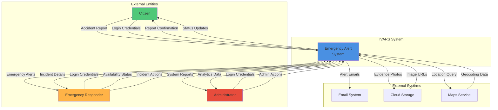
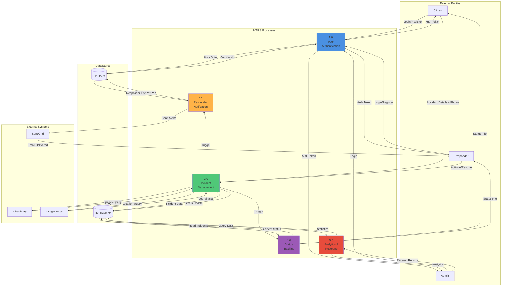
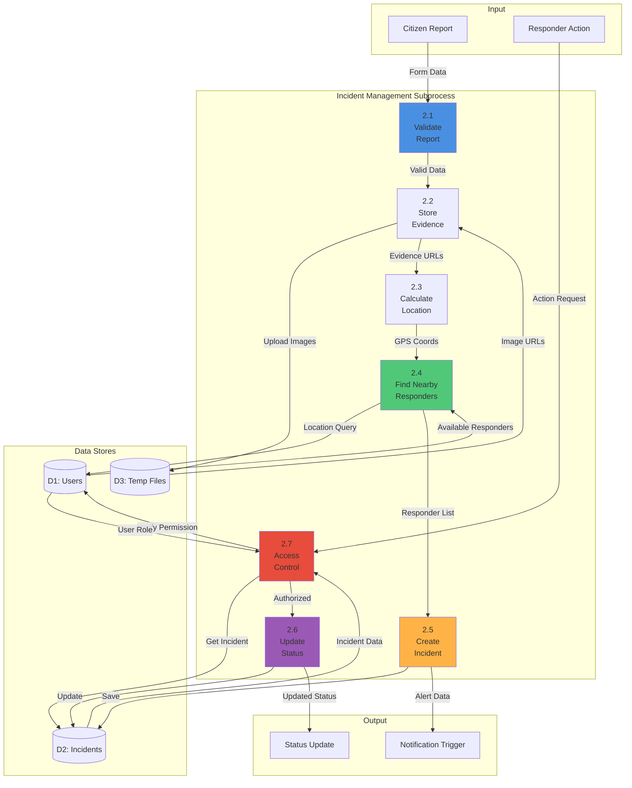

# Data Flow Diagram (DFD)

## Level 0: Context Diagram



## Level 1: Major Processes



## Level 2: Incident Management Process (Process 2.0)



## Data Store Details

### D1: Users Collection

**Inputs:**
- Registration data (Process 1.0)
- Location updates (Process 1.0)
- Availability status (Process 2.0)

**Outputs:**
- User credentials (Process 1.0)
- Responder list (Process 2.0)
- User profiles (Process 4.0)

**Data Structure:**
```javascript
{
  _id: ObjectId,
  name: String,
  email: String,
  password: String (hashed),
  role: Enum,
  coordinates: {lat, lng},
  responderType: String,
  responderStatus: Enum
}
```

### D2: Incidents Collection

**Inputs:**
- New incident reports (Process 2.0)
- Status updates (Process 2.0)
- Assignment updates (Process 2.0)

**Outputs:**
- Incident details (Process 3.0)
- Status information (Process 4.0)
- Analytics data (Process 5.0)

**Data Structure:**
```javascript
{
  _id: ObjectId,
  name: String,
  contact: String,
  location: String,
  gpsLocation: {lat, lng},
  description: String,
  images: [String],
  status: Enum,
  reportedBy: ObjectId,
  assignedTo: ObjectId,
  createdAt: Date,
  updatedAt: Date
}
```

## Detailed Process Descriptions

### Process 1.0: User Authentication

**Inputs:**
- User credentials (email, password)
- Registration data (name, email, password, role)

**Processing:**
1. Validate input format
2. Check user existence in D1
3. Hash password using bcrypt
4. Generate JWT token
5. Store/retrieve user data

**Outputs:**
- Authentication token
- User profile data
- Error messages (if validation fails)

**Data Flows:**
- User → [Login Credentials] → Process 1.0
- Process 1.0 → [User Data] → D1: Users
- D1: Users → [Stored Credentials] → Process 1.0
- Process 1.0 → [Auth Token] → User

---

### Process 2.0: Incident Management

**Inputs:**
- Accident report (name, contact, location, description, photos)
- Status update requests (activate, resolve)

**Processing:**
1. Validate report data
2. Upload evidence photos to Cloudinary
3. Parse GPS coordinates
4. Calculate distances to responders
5. Save incident to database
6. Apply access control rules

**Outputs:**
- Incident ID and confirmation
- Notification trigger to Process 3.0
- Status update confirmation

**Data Flows:**
- Citizen → [Report Data] → Process 2.0
- Process 2.0 → [Incident Record] → D2: Incidents
- Process 2.0 → [Query Location] → D1: Users
- D1: Users → [Responder List] → Process 2.0

---

### Process 3.0: Responder Notification

**Inputs:**
- Incident creation trigger
- Incident details (location, description, evidence)
- Responder email list

**Processing:**
1. Receive incident data from Process 2.0
2. Query nearby responders from D1
3. Generate email template with incident details
4. Send emails via SendGrid API
5. Log notification status

**Outputs:**
- Email notifications to responders
- Delivery status logs

**Data Flows:**
- Process 2.0 → [Incident Data] → Process 3.0
- Process 3.0 → [Get Responders] → D1: Users
- D1: Users → [Responder Emails] → Process 3.0
- Process 3.0 → [Email Request] → SendGrid
- SendGrid → [Delivered] → Responders

---

### Process 4.0: Status Tracking

**Inputs:**
- User ID
- Incident filters (status, assigned responder)

**Processing:**
1. Authenticate user
2. Query incidents from D2
3. Filter by user role and permissions
4. Format incident data for display
5. Return status information

**Outputs:**
- List of incidents with current status
- Assigned responder details
- Timeline updates

**Data Flows:**
- Citizen/Responder → [Status Request] → Process 4.0
- Process 4.0 → [Query] → D2: Incidents
- D2: Incidents → [Incident List] → Process 4.0
- Process 4.0 → [Status Info] → User

---

### Process 5.0: Analytics & Reporting

**Inputs:**
- Date range
- Filter criteria
- Report type

**Processing:**
1. Verify admin role
2. Aggregate incident data
3. Calculate statistics (total, resolved, pending)
4. Calculate response times
5. Generate visualizations

**Outputs:**
- System statistics
- Performance metrics
- Exportable reports

**Data Flows:**
- Admin → [Report Request] → Process 5.0
- Process 5.0 → [Aggregate Query] → D2: Incidents
- D2: Incidents → [Statistics] → Process 5.0
- Process 5.0 → [Analytics] → Admin

## Data Flow Summary Table

| From | Data | To | Purpose |
|------|------|-----|---------|
| Citizen | Login Credentials | Process 1.0 | Authentication |
| Process 1.0 | User Data | D1: Users | Store credentials |
| D1: Users | Stored User | Process 1.0 | Verify login |
| Process 1.0 | Auth Token | Citizen | Grant access |
| Citizen | Report + Photos | Process 2.0 | Create incident |
| Process 2.0 | Image Files | Cloudinary | Store evidence |
| Cloudinary | Image URLs | Process 2.0 | Reference photos |
| Process 2.0 | Incident Record | D2: Incidents | Persist data |
| Process 2.0 | Location Query | D1: Users | Find responders |
| D1: Users | Responder List | Process 2.0 | Notify nearby |
| Process 2.0 | Incident Data | Process 3.0 | Send alerts |
| Process 3.0 | Email Request | SendGrid | Deliver emails |
| SendGrid | Alert Email | Responders | Emergency notification |
| Responder | Action Request | Process 2.0 | Update status |
| Process 2.0 | Status Update | D2: Incidents | Record change |
| Process 2.0 | Notification | Citizen | Confirm action |
| User | Status Request | Process 4.0 | Track incidents |
| Process 4.0 | Query | D2: Incidents | Fetch data |
| D2: Incidents | Incident List | Process 4.0 | Return results |
| Process 4.0 | Status Info | User | Display updates |
| Admin | Report Request | Process 5.0 | View analytics |
| Process 5.0 | Aggregate Query | D2: Incidents | Calculate stats |
| D2: Incidents | Raw Data | Process 5.0 | Process metrics |
| Process 5.0 | Analytics | Admin | Display insights |
