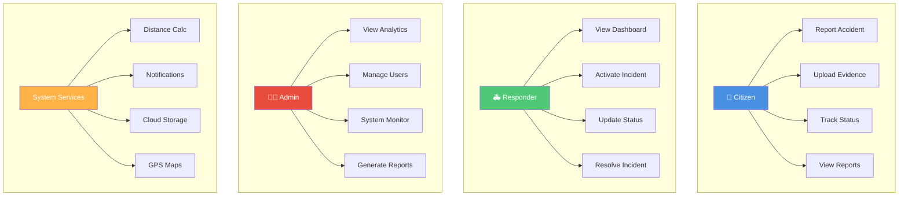

```mermaid
graph TD
    subgraph A1[" "]
        C[👤 Citizen]
        UC1[Report Accident]
        UC2[Upload Evidence]
        UC3[Track Status]
        UC4[View Reports]
        C --> UC1
        C --> UC2
        C --> UC3
        C --> UC4
    end
    
    subgraph A2[" "]
        R[🚑 Responder]
        UC5[View Dashboard]
        UC6[Activate Incident]
        UC7[Update Status]
        UC8[Resolve Incident]
        R --> UC5
        R --> UC6
        R --> UC7
        R --> UC8
    end
    
    subgraph A3[" "]
        A[👨‍💼 Admin]
        UC9[View Analytics]
        UC10[Manage Users]
        UC11[System Monitor]
        UC12[Generate Reports]
        A --> UC9
        A --> UC10
        A --> UC11
        A --> UC12
    end
    
    subgraph A4[" "]
        SYS[System Services]
        S1[Distance Calc]
        S2[Notifications]
        S3[Cloud Storage]
        S4[GPS Maps]
        SYS --> S1
        SYS --> S2
        SYS --> S3
        SYS --> S4
    end
    
    style C fill:#4A90E2,color:#fff
    style R fill:#50C878,color:#fff
    style A fill:#E74C3C,color:#fff
    style SYS fill:#FFB347,color:#fff
```
